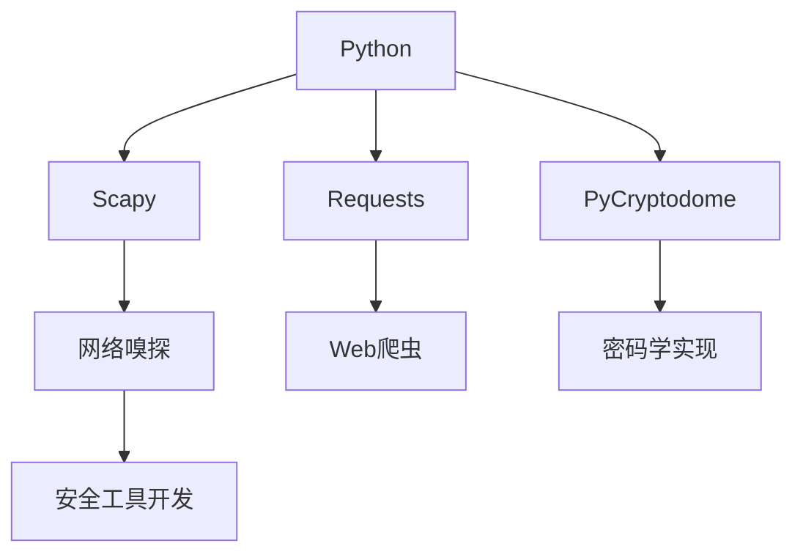
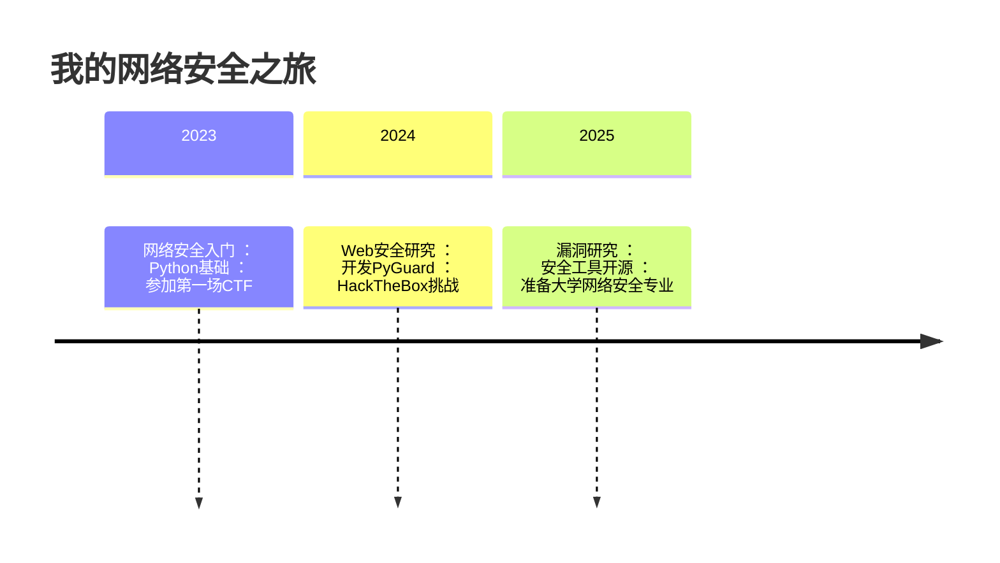

# 🚀 [你的名字] | 网络安全研究员 | Python开发者

> `高二学生` • `CTF选手` • `安全工具开发者`  
> *"In a world of ones and zeros, I build digital fortresses."*

---

## 🛠️ 技术栈与工具

### 🔌 核心能力

### 🧩 技术生态

---

## 🔥 活跃项目

| 项目 | 描述 | 技术栈 | 状态 |
|------|------|--------|------|
| [**PyGuard**](https://github.com/yourname) | 自动化漏洞扫描框架 | `Python` `Nmap` `SQLi检测` |  |
| [**CTF-Kit**](https://github.com/yourname) | CTF比赛工具集合 | `密码学` `逆向工程` `隐写术` |  |
| [**NetWatch**](https://github.com/yourname) | 实时网络流量监控 | `Scapy` `Matplotlib` `Flask` |  |

---

## 📈 学习轨迹

---

## 📚 最新文章

- 🔐 [Python实现AES加密全过程详解](https://yourblog.com/aes-in-python)
- 🌐 [从0搭建渗透测试环境：Kali Linux指南](https://yourblog.com/kali-setup)
- 🕵️‍♂️ [CTF中常见的密码学挑战解题模式](https://yourblog.com/ctf-crypto)
- 🧩 [使用Scapy分析ARP欺骗攻击](https://yourblog.com/arp-spoofing)

---

## 🏆 成就墙

---

## 🌐 连接我

---

## 📊 每日编码统计

> *"The quieter you become, the more you are able to hear." - 黑客箴言*

