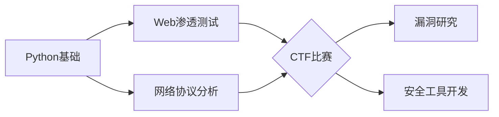

以下是为您量身定制的GitHub个人主页美化方案（Markdown格式），融合网络安全元素与Python技术特色：


# 🛡️ Hi, I'm [你的名字] - Cyber Security Explorer

> **高二学生 | Python代码守护者 | CTF挑战者**  
> *"Encrypting the future, one line of Python at a time."*

---

## 🧪 我的技术武器库


---

## 🔭 正在进行的安全项目
| 项目名称 | 技术栈 | 状态 | 
|----------|--------|------|
| [PyGuard - 漏洞扫描工具](https://github.com/yourname/) | `Python` `Scapy` `多线程` | 🚧 开发中 | 
| [CTF解题库](https://github.com/yourname/) | `Python密码学` `逆向工程` | 🌱 持续更新 |
| [网络流量分析器](https://github.com/yourname/) | `Wireshark` `Pandas分析` | ✅ 已上线 |

---

## 📡 我的安全探索轨迹


---

## 📚 技术博客精选
- 🔓 [用Python实现RSA加密算法原理](你的博客链接)
- 🕵️‍♂️ [Wireshark抓包分析实战案例](你的博客链接)
- 🛡️ [Python构建简易防火墙思路](你的博客链接)

---

## 🏆 安全成就墙


---

## 📫 连接我的安全哨站
[](你的HTB主页)
[](你的THM主页)
[](你的知乎主页)
```
